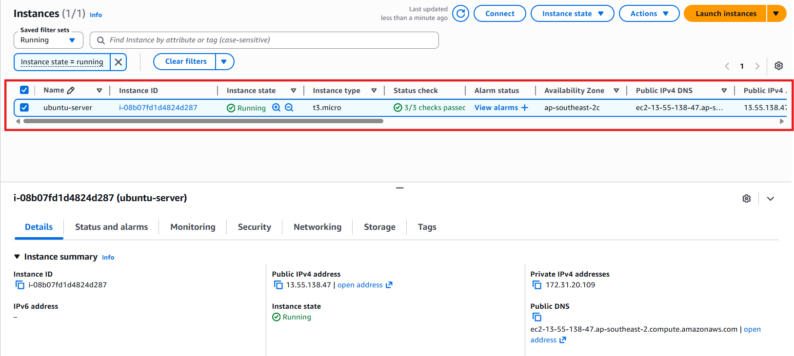
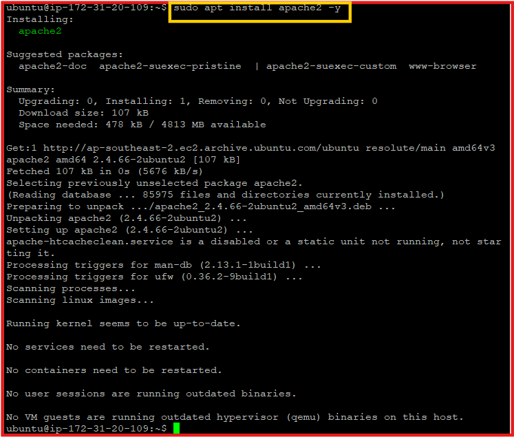
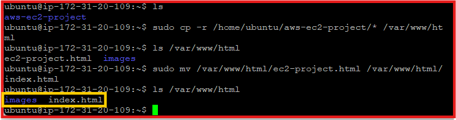
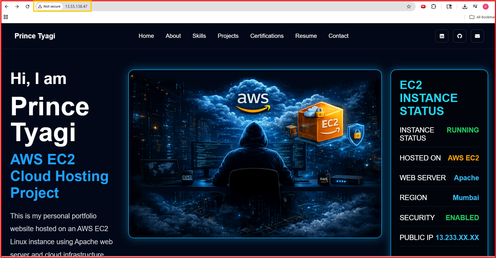

# AWS EC2 Web Hosting Project

## Objective
Host a static HTML website on AWS EC2 Ubuntu instance using Apache Web Server.

---

## Services Used
- AWS EC2
- Ubuntu Linux
- Apache2
- Security Groups

---

## Step 1 - Create EC2 Instance

Create Ubuntu EC2 instance from AWS Console.



---

## Step 2 - Connect EC2 using SSH

Connect instance using SSH.


---

## Step 3 - Install Apache

```bash
sudo apt update
sudo apt install apache2 -y
```



---

## Step 4 - Upload Website Files

Upload HTML website files into:

```bash
/var/www/html
```



---

## Step 5 - Access Website

Copy public IP and open in browser.



---

# Final Result

Website successfully hosted on AWS EC2.
